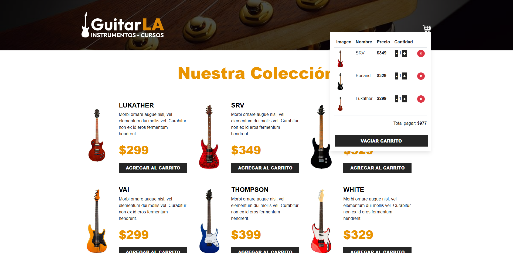

# 🛒 Carrito de Compras de Guitarras con React + Vite + TS + Reducers

Este es un repositorio basado del proyecto [tienda-guitarras](https://github.com/sara-patino/tienda-guitarras) pero migrado a typescript y usando reducer en vez de el hook de useCart.  Es un proyecto de una página web reactiva en la cual es una tienda de guitarras con un carrito de compras reactivo.

## ⚙️ Tecnologías usadas

- ⚛️ [React](https://react.dev/)
- 🧠 [TypeScript](https://www.typescriptlang.org/)
- ⚡ [Vite](https://vitejs.dev/)

## 🚀 Deployment en Netlify
[https://precious-mooncake-1be31b.netlify.app/](https://guitarla-ts-reducer-sarap.netlify.app/)

## 👁️ Vista Principal

